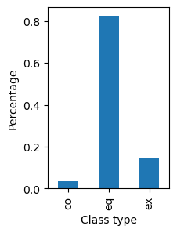
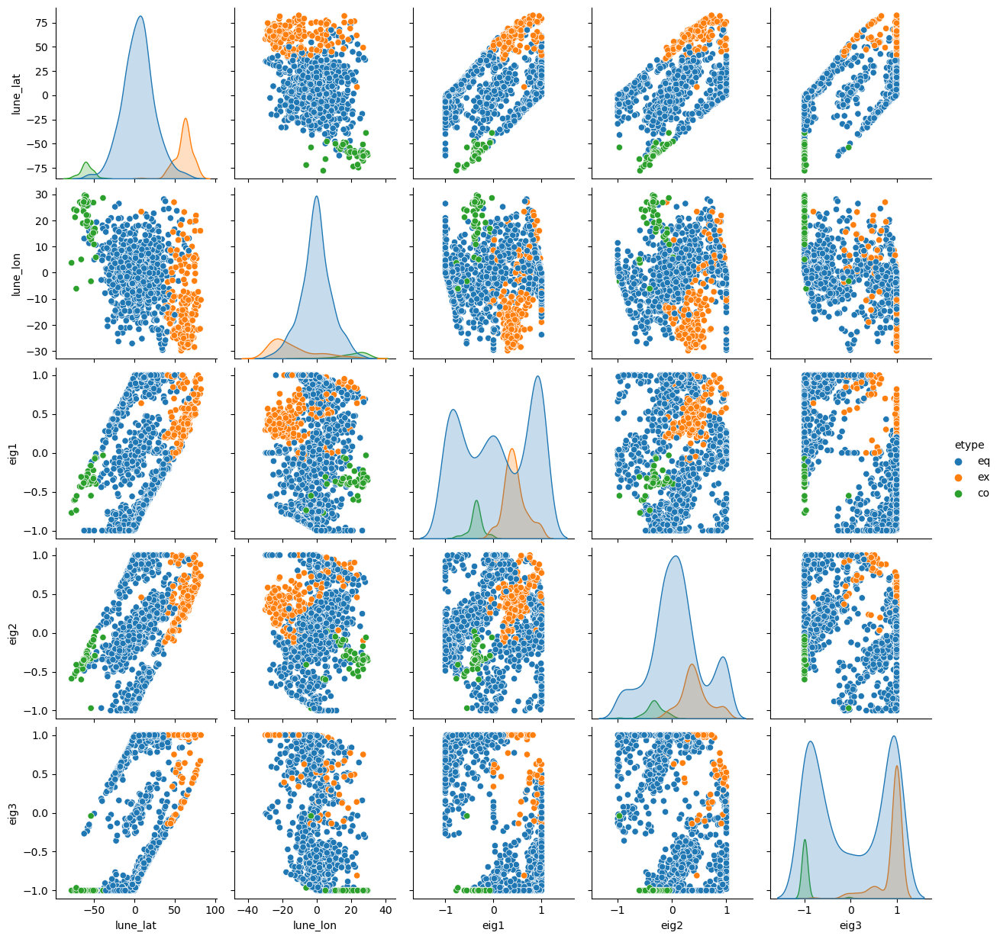
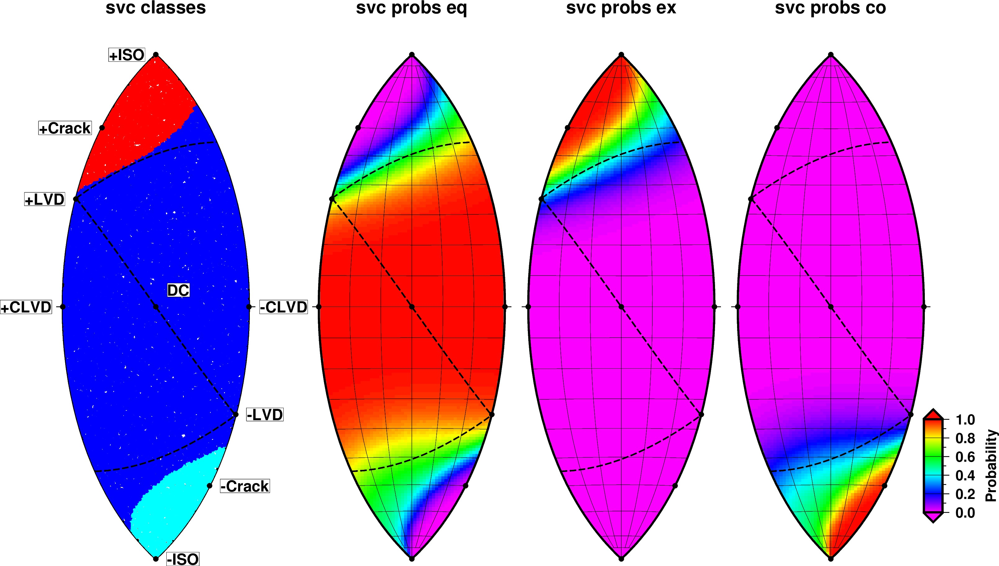

# Moment tensor based multinomial classifiers for Earthquake, Explosion, and Collapse Seismic Soure Types

## Capstone Project 24.1: Report and Presentation

version 03/09/2023

## Business Understanding

Nuclear explosion monitoring and detonation detection systems use signals collected from a global network of seismic, infrasonic, hydroacoustic, and air-sampling sensors as well as orbiting satellites with cameras and radiation detecting sensors [(see CTBTO IMS)](https://www.ctbto.org/our-work/ims-map).  All nuclear weapons testing has gone underground since 1960’s due to concerns of public safety from atmospheric tests.  U.S. and international monitoring agencies rely heavily on seismic sensors to detect, locate, and discriminate clandestine nuclear tests in a sea of background activity from natural earthquakes, volcanic activity, bolides, anthropogenic explosions from industrial activity, and cavity collapses from mining [(see graphic)](https://gs.llnl.gov/sites/gs/files/2021-09/earthquake_lg_0.jpg). 

State-of-the-art algorithms developed in the 1980s and 1990s automatically process seismic data to make detections, associate signals for building and locating events. However, pipeline seismic analysis workflow (e.g., earthquake, volcanic, and explosion monitoring observatories) still requires teams of human analysts who work shifts 24/7, to refine measurements and retune algorithms. The burden on these human analysts is growing as the number of sensors grows due to technological advances ([see graphic](https://ds.iris.edu/files/stats/data/archive/Archive_Growth.jpg)). Artificial intelligence and machine learning algorithms are needed to help modernize seismic data processing. Early focus was on seismic signal detection (e.g., [Ross et al., 2018](https://arxiv.org/abs/1805.01075); [Kong et al., 2018](https://doi.org/10.1785/0220180259); [Mousavi et al., 2020](https://www.nature.com/articles/s41467-020-17591-w)) using deep learning approaches. We focus here on the final step of seismic processing workflow – discrimination or identification -- that requires classifying a set of signals from a seismic event as either explosion, earthquake or collapse based on the radiation pattern of the signal amplitudes recorded by a network of sensors. 

In the world of nuclear explosion monitoring, the mantra is “miss no explosion” even at the expense of having false alarms.  The consequences of missed detection is much higher than falsely accusing a nation for testing a nuclear weapon ([see news media article on the 1997 Kara Sea Event](https://www.armscontrol.org/act/1997-10/press-releases/cia-says-seismic-event-near-russian-test-site-not-nuclear-explosion)). In this case we will focus more on metrics like recall, balanced accuracy, and f1-score than just accuracy. 

## Data Understanding

The data features that we use are output from a physic based model of a seismic source. Seismic waveform time-series from a network of sensors can be fit using complex models that replicate the waveforms given an earth propagation response to a generalized model of the seismic source represented as a set of forces.  The data that we use here are called moment tensors determined from the linear inversion of seismic ground motions.  

The moment tensor (MT) is a mathematical representation of a generalized seismic source that quantify a set of forces and orientations based on the source’s radiation pattern.  The MT is mathematically represented as a 2nd-order symmetric tensor expressed as a 3-by-3 matrix (i.e., as three shear force couples and three linear vector dipole forces).  In a Cartesian coordinate system (i.e., x-axis: +east/-west, y-axis: +north/-south, z-axis: +up/-down), the dipole forces are contained along the diagonal Mxx, Myy, and Mzz of the tensor.  The off-diagonal elements Mxy, Mxz, and Myz contain the shear force couples. Through the conservation of angular momentum, there are two force-couples (a.k.a. the double-couple), with one acting in the opposite direction to the other. The MT is symmetrical and therefore Mxy=Myx, Mxz=Mzx, and Myz=Mzy resulting in only six of nine unique tensor elements, that can also be in vector form M ([see MT diagram](https://www.usgs.gov/media/images/momenttensorgif)).  

<I>Figure above shows the relationship between force couples (dipoles and double-couples) from a moment-tensor (MT), radiation pattern generated by these forces, a geometric representation of the radiation pattern called a focal mechanism, and the physical mechanisms (e.g.,) explosions or collapses, earthquakes, and volcanic processes like magma movement in a dike or caldera inflation and deflation. These MTs and physical mechamsism can be mapped to a point on a sphere called a source-type plot that will be explained more in the Data Preparation section.</I>  

We have compiled a set of moment tensor solutions from 1440 earthquakes, explosions, and cavity collapses. Collapses associated with mining activity and underground nuclear explosions are based on a preliminary small set of 43 events (Pasyanos et al., 2023; in prep). For explosions, we use the MT database from [Pasyanos and Chiang (2022)](https://doi.org/10.1785/0120210167) which includes many US underground nuclear tests as well as accidental or experimental chemical explosions.  For the earthquake population, we use the same full MT solution dataset that was used for event identification in Pasyanos and Chiang (2022).  This includes the datasets of Dreger et al. (2000), [Minson and Dreger (2008)](https://doi.org/10.1111/j.1365-246X.2008.03797.x), [Ford et al. (2009)](https://doi.org/10.1029/2008JB005743), [Boyd et al. (2015)](https://doi.org/10.1785/0120140285). The class labels for this dataset assumes that seismic events reported by the USGS are natural earthquakes.  The explosions are mainly from underground U.S. testing in southern Nevada ([Department of Energy publication NV-209](https://www.nnss.gov/docs/docs_librarypublications/doe_nv-209_rev16.pdf)) but other chemical explosions and mining accidents worldwide are reported in news media. 

## Data Preparation

We used principal component analysis (PCA) to convert the 6 moment tensor elements (Mxx, Myy, Mzz, Mxy, Mxz, Myz) to 3 eigenvalues (eig1, eig2, eig3).  We also convert these 3-eigenvalues using a projection to spherical space (e.g., Tape and Tape, 2012) reducing the 3 eigenvalues to lune latitude and longitude.  The lune is a crescent-shape portion of a sphere (in this case just one-sixth of the full sphere) and latitude and longitude are adapted from the coordinates system commonly used in geography. The lune latitude is a measure of the seismic source’s isotropic component. The lune longitude is a measure of the compensated linear vector dipole. There are 3 conanical sources: DC, +ISO, and -ISO.  All pure double-couple (DC) source “earthquakes” plot at the origin (latitude=0 and longitude=0; eig1=-1, eig2=0, eig3=+1). All pure explosions (+ISO) plot at the north pole (latitude=+90, longitude=0; eig1=+1, eig2=+1, eig3=+1) and all pure implosions (-ISO) plot at the south pole (latitude=-90, longitude=0; eig1=-1, eig2=-1, eig3=-1).  Interestingly, most nuclear explosions plot as an opening crack (latitude=60, longitude=-30; eig1=+1, eig2=+1, eig3=+2) and mine collapses as a closing crack (latitude=-60, longitude=+30; eig1=-1, eig2=-1, eig3=-2).   

<i>Eigenvalues on a sphere and the lune (taken from [Tape and Tape (2012)](https://drive.google.com/file/d/1xWT5qCsYR36add5y50Fs5DbmPvjihiUE/view)). The shaded "lune" region (one-sixth of the sphere) was shown in the previous figure as the source-type space as well as the labels (ISO-isotropic, C-crack, DC-double-couple, LVD-linear vector dipole, and CLVD-compensated linear vector dipole.)</i>

The original input features used to train the classifier models are the 6 moment tensor elements (Mxx, Myy, Mzz, Mxy, Mxz, Myz), the 3 eigenvalues (eig1, eig2, eig3) and 2 lune parameters (lune_lat, lune_lon).  We found that this made the decision boundaries rough and scattered and multiclass probabilities very unstable. This may be an effect of over fitting when using too many features.  Testing with 5 features (lune_lat, lune_lon , eig1, eig2, eig3) also led to instabilities in the decision boundaries. We finally concluded that using only two features (lune_lat, lune_lon) obtained stable classification boundaries. 

Use dictionary event_dict={0: ‘eq’, 1: ‘ex’, 2: ‘co’} to df.map(event_dict) labels the three numerical class types:
1. Earthquake “eq” class=0
2. Explosion  “ex” class=1
3. Collapse   “co” class=2

Class imbalance:
1. eq 82.4%
2. ex 14.3%
3. co  3.3%

<i>Histogram of percentages of dataset for each class label.</i>

### Correlation

Since lune_lat is derived from the diagonal of the MT (mxx, myy, and mzz), we find the usual expected correlations between these values.  We see that no one of the features by themselves correlate very well with the numerical class label which indicates that 2 or more features is needed for classification.  

<i>Seaborn heatmap of correlation values for all feature pairs. There are many moderate correlation between the features since they are all derived from the MT (mxx, myy, mzz, etc...).  The eigenvalues (eig1, eig2, and eig3) are derived from the MT using PCA, and the lune_lat and lune_lon are transformed from the eigenvalues.</i>

Seaborn Pairplot

<i>Seaborn pairplot of the dataset features.  We see the 2-dimensional space with lune_lat and lune_lon will work best for classification</i>
 

<i>The 2 features, lune_lat and lune_lon, which are selected to train classifiers, are shown in linear (x,y) Cartesian cooridinate system.  </i>

GMT plot

<i> Same plot as above of two features (lune_lat and lune_lon) used to train classifiers in spherical Hammer projection (longitude,latitude) coordinate system.  The Hammer projection "spherical" is a better projection compared to linear for seperating the classes.</i>

This type of Hammer spherical projection is preferred over others including Cartesian because it preserves the true physical distances between points and the areas of source types.  This is similar to the distortion some map projections make on the area of land masses near the poles.  

We didn't use python matplotlib to do the Hammer projection because it does not allow adjustment of the longitude range, only plots the whole globe 0-360 or -180 to +180.  We instead used Genergic Mapping Tools (GMT) software package ([link](https://www.generic-mapping-tools.org))

### PCA analysis

<pre>
features_mt = ['mxx', 'myy', 'mzz', 'mxy', 'mxz', 'myz']
X_mtonly = df[features_mt]
scaler = StandardScaler()
Xscaled = scaler.fit_transform(X_mtonly)
pca = PCA()
pca.fit_transform(Xscaled)
n_components = 6 features=6 n_samples=1440
explained_variance = [ 4.65  1.36  0.00  0.00  0.00  0.00]
explained_variance_ratio = [ 0.77  0.23  0.00  0.00  0.00  0.00]
singular_values = [ 81.78  44.18  0.04  0.02  0.00  0.00]
</pre>

It is interesting to note that the PCA with 6 components results in only 2 values that have significance indicating that the problem can be reduced to just 2 dimensions. We therefore reran PCA with n_components=2 and make a scatter plot. 

<i>A scatterplot of pc1 and pc2 from the PCA with 2 components. The linear transformation from reducing the dimensionality from 6 to 2 does not seperate the class labels as well as using spherical projection of the eigenvalues.</i> 

The PCA derived features was leading to unstable decision boundaries.  We hypothesize this is due to overfitting.  For now we are only using lune_lat and lune_lon as the features to train using the class labels. 

## Modeling Steps: 

1. Training testing split (train 60%; testing 40%) - we chose 40% because of the class imbalance.
2. 
3. Test sets of features, the first set works the best:
  * features = ['lune_lat', 'lune_lon']
  * features = ['mxx', 'myy', 'mzz', 'mxy', 'mxz', 'myz']
  * features = ['eig1', 'eig2', 'eig3']
4. Set up one-vs-rest version of classifiers (options class_weight=’balanced’ when available) for multiclass problems.
  * See list of 10 classifiers below
5. Set up pipeline
  * Standard scalar 
  * Classifier with one-vs-rest
6. Set up hyperparameter search ranges (these depend on which classifier)
7. Grid search over hyperparameter
  * Use 5-fold cross validation
  * Scoring = ‘balanced_accuracy’
  * Balanced accuracy = (sensitivity + specificity)/ 2
  * Sensitivity = recall = TP / (TP + FN)
  * Specificity = TN / (TN + FP)
8. Save the trained models to a disk file for later class predictions and class probabilites using a set of synthetics
9. Make a Pandas DataFrame table of scores and metric values
  * Class precision, recall, f1-score
  * Accuracy
  * Macro average
  * Weighted average
10. Compute the multiclass values for TP, TN, FP, and FN and plot confusion matrix
11. Plot multiclass ROC and average ROC curves, compare AUC values
12. When classifiers have clf.decision_function() method then plot the multiclass precsion and recall curves.

For the modeling we tested 10 classifiers: 
1. Support Vector Machine (SVC) 
2. Decision Tree Classifier (DTC)
3. K-Neighbors Classifier (KNN)
4. Logistic Regression Classifier (LGR)
5. Random Forest Classifier (RFC)
6. Gaussian Process Classifier (GPC)
7. Multi-layer Perceptron Classifier (MLP)
8. Ada Boost Classifier (ABC)
9. Gaussian Naïve Bayes (GNB)
10. Quadratic Discriminant Analysis (QDA)

## Evaluation

Below are selected examples from the Support Vector Machine classifier (SVC). The full set of results, tables, and plots are in the Jupyter notebooks.

### SVC Training and Validation Testing Results
<PRE>
Fitting 5 folds for each of 35 candidates, totalling 175 fits
Pipeline(steps=[('scaler', StandardScaler()),
                ('svc',
                 OneVsRestClassifier(estimator=SVC(C=30,
                                                   class_weight='balanced',
                                                   gamma=0.01,
                                                   probability=True)))])
best param={'svc__estimator__C': 30, 'svc__estimator__gamma': 0.01, 'svc__estimator__kernel': 'rbf'}  best score=0.980
</PRE>
We tuned the hyperparamters to optimize the estimator using the training dataset.

<pre>
              precision    recall  f1-score   support

          eq       0.99      0.93      0.96       464
          ex       0.76      0.97      0.85        86
         col       0.81      1.00      0.90        26

    accuracy                           0.94       576
   macro avg       0.86      0.97      0.90       576
weighted avg       0.95      0.94      0.94       576
</pre>
Table of scores and metrics for SVC classifier. SVC performed the best for the ex recall 0.97 with acceptable false alarms (precision 0.76). 
 
Confusion matrix for SVC classifier.

 
ROC curve for SVC 

Precision-Recall curve for SVC

To evaluate the classifiers, we simulate 50,000 randomly distributed input features to compute class probabilities using clf.predict_proba(X)

Classification decision boundaries and class probabilities for SVC classifier 

## Deployment 

We save the classification models and included a second jupyter notebook with code to apply classifiers to new data to obtain class probabilities.

## Summary of Findings

1. The best set of features are lune_lat and lune_lon.  Adding additional features Mxx, Myy, ..., eig1, eig2, eig3 only caused overfitting and unstable decision bondaries. 

2. SVC classifier works best so far but we are still evaluating 9 other classifier methods.

3. Below is a summary of metrics from difference classifiers

## Future Work, Next Steps

1.  At the time of this report, lessons on Random Forest, Bagging and bootstraping, AdaBoost, GBM, and XGB were not taught yet.  After learning more I will go back and add or refine the analysis. Since the dataset is small, only 1440 rows, then bootstrap resampling may help. 

2. The raw features are the moment tensor elements (Mxx, Myy, Mzz, Mxy, Mxz, Mxz). From PCA, eigen-values are derived from these features.  Further-more, lune_lat and lune_long are derived from eigenvalues.  Therefore there is high correlation of all the features (duplicate) leading to population overlap and potential for overfitting. The next step is to try and compare the classification by using these individually rather than all together.
